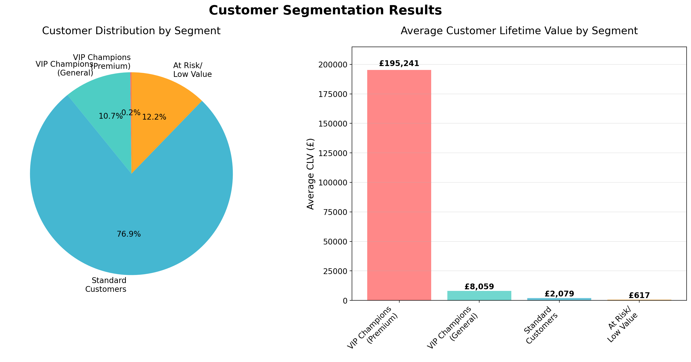
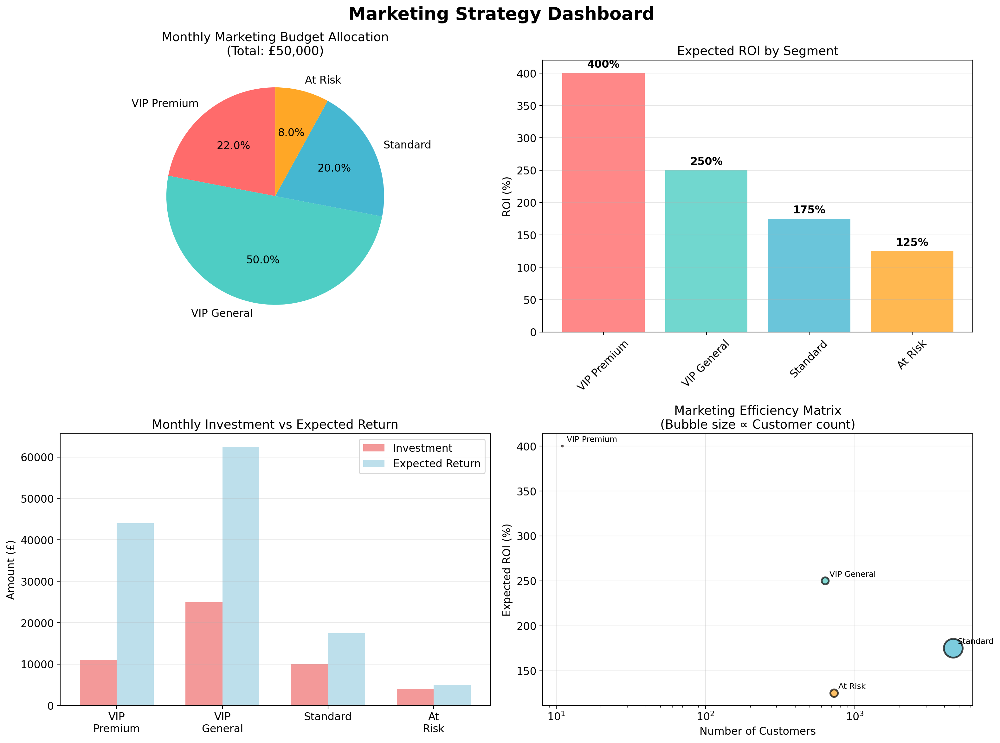
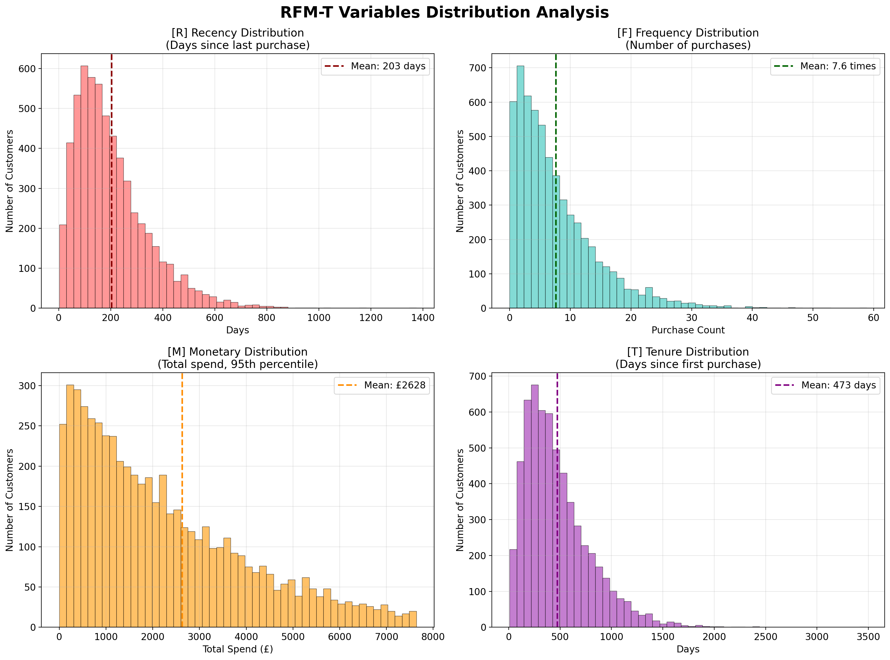
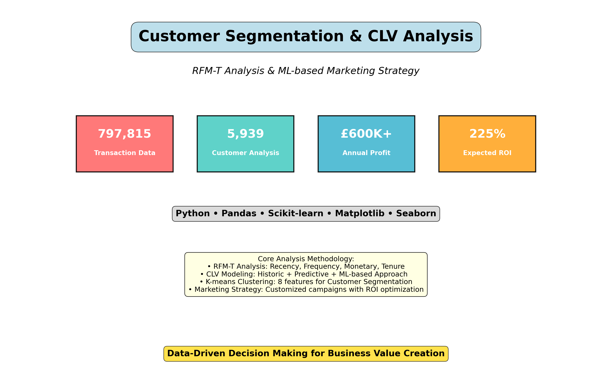

# customer-segmentation-clv-analysis
RFM-T Analysis &amp; CLV-based Customer Segmentation for Marketing Strategy
## 🚀 핵심 결과

  
  

<!-- 추가 이미지들 -->

### 📈 RFM-T 분포 분석

### 📊 프로젝트 개요

**개발자**: [김주헌]  
**이메일**: [kjhcorn@naver.com]  
**LinkedIn**: [https://www.linkedin.com/in/%EC%A3%BC%ED%97%8C-%EA%B9%80-964b65382/]

**개발 기간**: 2024.07.01 - 2025.09.30